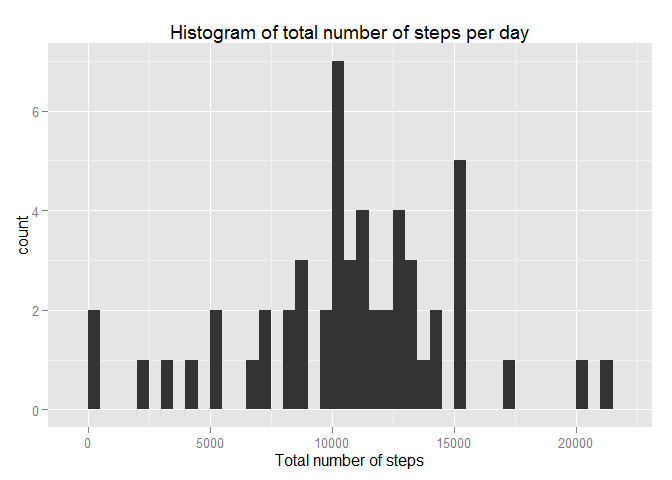
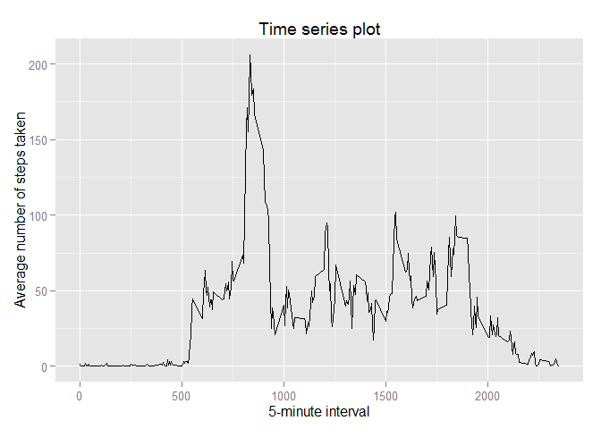
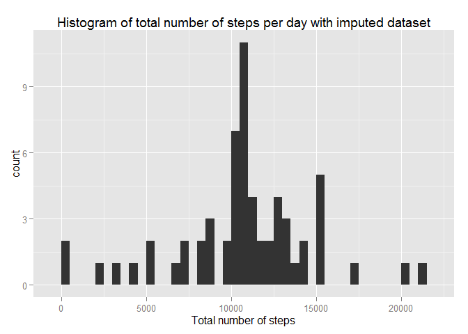
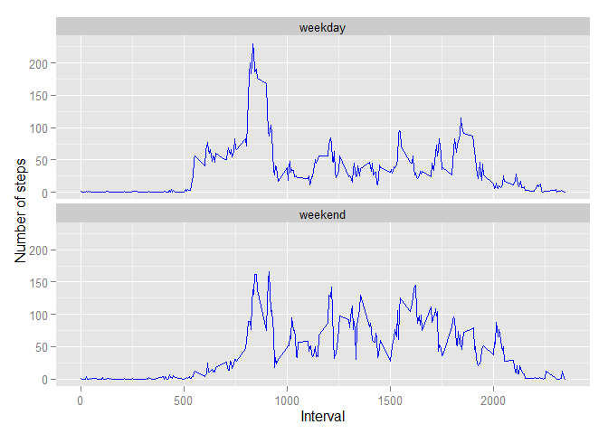

# Reproducible Research: Peer Assessment 1

This document contains my submission for peer assesment 1 of the reproducible research Coursera course.

## Loading and preprocessing the data
### 1
First load some packages and load the dataset, where the file should be in the current directory.

```r
#Load packages
library(ggplot2)
```

```
## Warning: package 'ggplot2' was built under R version 3.1.3
```

```r
library(plyr)
```

```
## Warning: package 'plyr' was built under R version 3.1.3
```

```r
data <- read.csv("activity.csv")
```
### 2
Transform the data column of the dataset into a date format.

```r
data$date <- as.Date(data$date, format = "%Y-%m-%d")
```

## What is mean total number of steps taken per day?
### 1
For this question I interpeted "ignore the missing values" as, "remove the missing values". Therfore for these calculations I calculated the total number of steps of all non-missing values, hence the use of the `is.na` function. The `ddply` function from the `plyr` package calculates the total number of steps for each date.

```r
total_nof_steps <- ddply(data[!is.na(data$steps),], "date", function(x){sum(x$steps)})
names(total_nof_steps) <- c("date", "total_nof_steps")
```

### 2
I made the histogram using `ggplot` from the `ggplot2` package and manually created a binwidth of 500.

```r
plot1 <- ggplot(data=total_nof_steps, aes(x = total_nof_steps)) + geom_histogram(binwidth = 500) +
    labs(title = "Histogram of total number of steps per day", x = "Total number of steps")

print(plot1)
```

 

### 3
Calculate the mean and median of total numer of steps taken per day.

```r
mean <- mean(total_nof_steps$total_nof_steps)
median <- median(total_nof_steps$total_nof_steps)

print(paste("The mean of the total number of steps taken per day equals",mean))
```

```
## [1] "The mean of the total number of steps taken per day equals 10766.1886792453"
```

```r
print(paste("The median of the total number of steps taken per day equals",median))
```

```
## [1] "The median of the total number of steps taken per day equals 10765"
```

## What is the average daily activity pattern?
### 1
Again for this question I removed the rows containing missing values. Using the `ddply` function I calculated the mean number of steps for each 5 minute interval.

```r
average_nof_steps <- ddply(data[!is.na(data$steps),], "interval", function(x){mean(x$steps)})
names(average_nof_steps) <- c("interval", "average_nof_steps")
```
I plotted the outcome using the `ggplot` function.


```r
plot2 <- ggplot(data=average_nof_steps, aes(x = interval, y = average_nof_steps)) + 
    geom_line() +
    labs(title = "Time series plot", x = "5-minute interval", y = "Average number of steps taken")

print(plot2)
```

 

### 2
Determine the maximum number of steps on average across all days. And next determine the corresponding 5-minute interval


```r
maximum <- max(average_nof_steps$average_nof_steps)
max_interval_index <- which(average_nof_steps$average_nof_steps == maximum)
max_interval <- average_nof_steps$interval[max_interval_index]
print(paste("The 5-minute interval with maximum number of steps is",max_interval))
```

```
## [1] "The 5-minute interval with maximum number of steps is 835"
```


## Imputing missing values
### 1
First see which rows contain missing values by using the `complete.cases` function. Next calculate how many rows contain missing values.


```r
incomplete_cases <- !(complete.cases(data))
nof_missing_rows <- sum(incomplete_cases)
print(paste("The total number of rows with NA's equals",nof_missing_rows))
```

```
## [1] "The total number of rows with NA's equals 2304"
```

### 2
My strategy for filling in all the missing values is using the mean of the corresponding 5-minute time interval. I can use the already calculated `average_nof_steps` to fill in these values.

### 3
Now I create the new dataset by filling in the missing values

```r
new_data <- data
new_data[incomplete_cases, "steps"] <- average_nof_steps[
    match(new_data$interval[incomplete_cases],average_nof_steps$interval), "average_nof_steps"]
```

### 4
First calculate the new total number of steps taken each day.

```r
new_total_nof_steps <- ddply(new_data, "date", function(x){sum(x$steps)})
names(new_total_nof_steps) <- c("date", "total_nof_steps")
```

And now plot a histogram

```r
plot3 <- ggplot(data=new_total_nof_steps, aes(x = total_nof_steps)) + geom_histogram(binwidth = 500) +
    labs(title = "Histogram of total number of steps per day with imputed dataset", x = "Total number of steps")

print(plot3)
```

 

Calculate the new mean and meadian and report these values.

```r
new_mean <- mean(new_total_nof_steps$total_nof_steps)
new_median <- median(new_total_nof_steps$total_nof_steps)

print(paste("The new mean of the total number of steps taken per day equals",new_mean))
```

```
## [1] "The new mean of the total number of steps taken per day equals 10766.1886792453"
```

```r
print(paste("The new median of the total number of steps taken per day equals",new_median))
```

```
## [1] "The new median of the total number of steps taken per day equals 10766.1886792453"
```

We see that the new mean is equal to the old mean but that the median has increased.

The impact of the way I imputed missing data on the estimates of the total daily number of steps is that we see higher counts of the total daily number of steps around the average value for this number. As can be seen when comparing the two histograms (the bins in the middle are higher)


## Are there differences in activity patterns between weekdays and weekends?
### 1
First use the `weekdays` function to obtain the days of the week for each row of the data

```r
factor <- weekdays(new_data$date, abbreviate = "TRUE")
```

Determine which days are in the weekend and create a vector with the factor levels

```r
weekend <- (factor == "Sat" | factor == "Sun")

factor[weekend] <- "weekend"
factor[!weekend] <- "weekday"
```

Add the vector with the factor levels to the dataset after transforming the the vector to factor variables.

```r
new_data <- cbind(new_data, factor_var = as.factor(factor))
```

### 2 
Using the `ddply` function calculate the average number of steps for each interval for both weekdays as for weekends.

```r
result <- ddply(new_data, c("factor_var", "interval"), function(x){mean(x$steps)})
names(result) <- c("factor_var", "interval", "avg")
```

Create a panel plot using the `facet_wrap` option of `ggplot`.

```r
plot4 <- ggplot(data=result, aes(x = interval, y = avg)) + geom_line(color = "blue") + 
    facet_wrap(~ factor_var, ncol = 1) +
    labs(y = "Number of steps", x = "Interval")

print(plot4)
```

 
